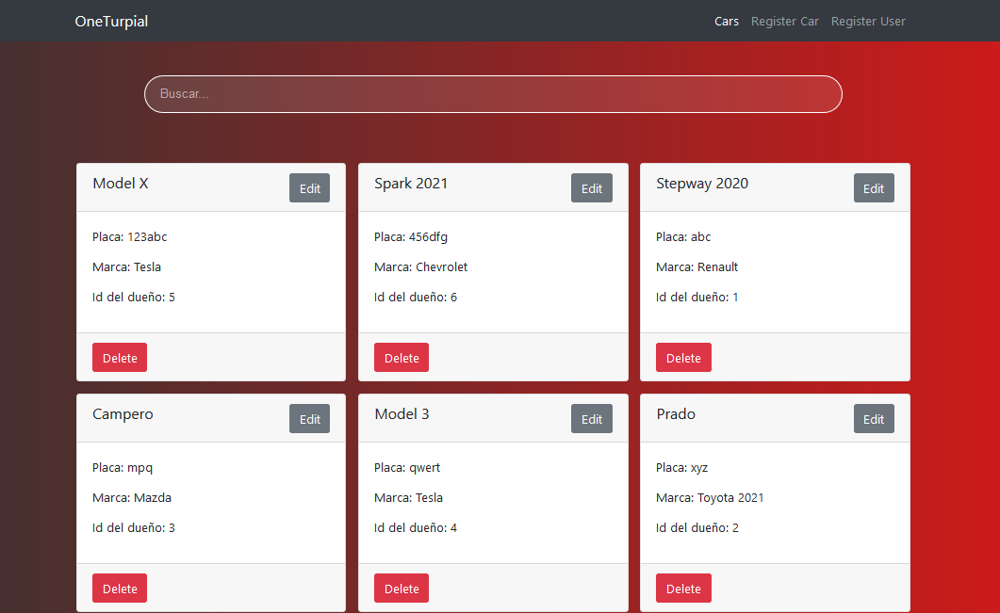
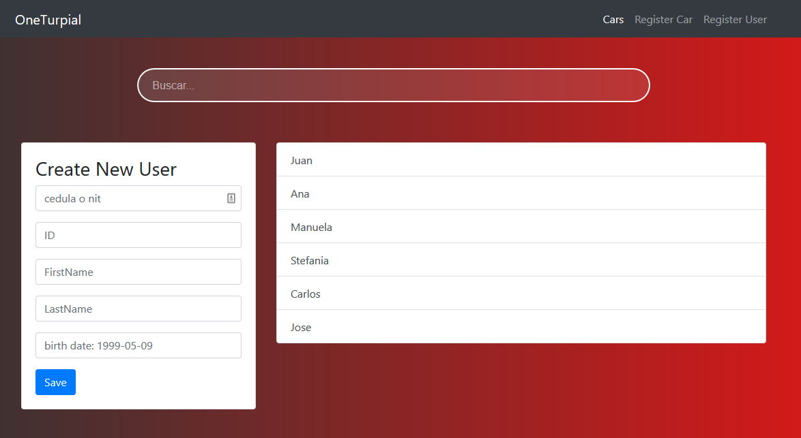
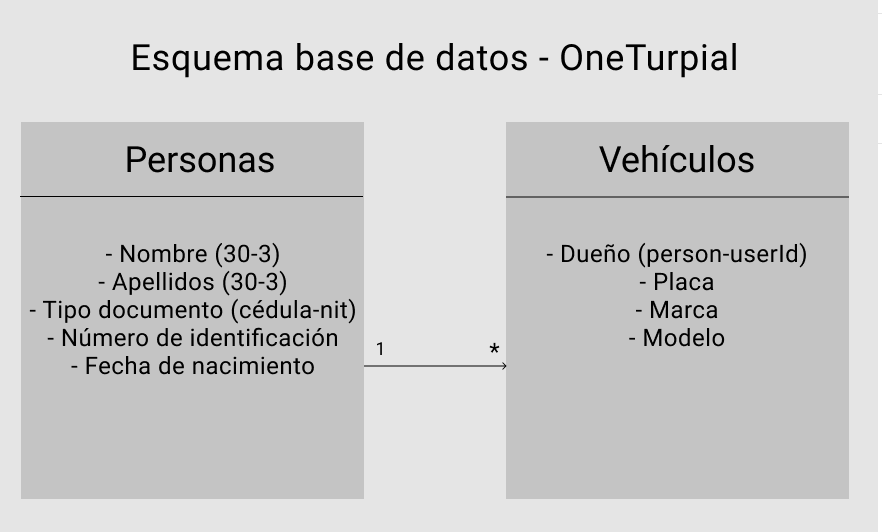

# Code challenge for OneTurpial's candidates.  
CRUD of persons - cars      



# Instructions
Follow this steps in frontend and backend folder:

## Installation

```bash
# Backend - Frontend
$ npm install
```

## Running the app

```bash
# Frontend
$ npm run start   

# Backend
$ npm run dev
```

## Preview Persons  



## Database Schema


## Stay in touch

- Feel free to do a pull request
- Website - [juanjosevega99.github.io](https://juanjosevega99.github.io/)
- Twitter - [@juanjosevega99](https://twitter.com/juanjosevega99)
